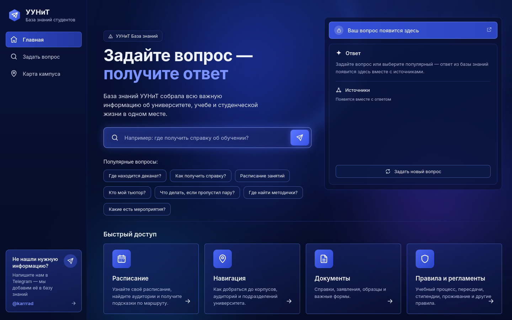
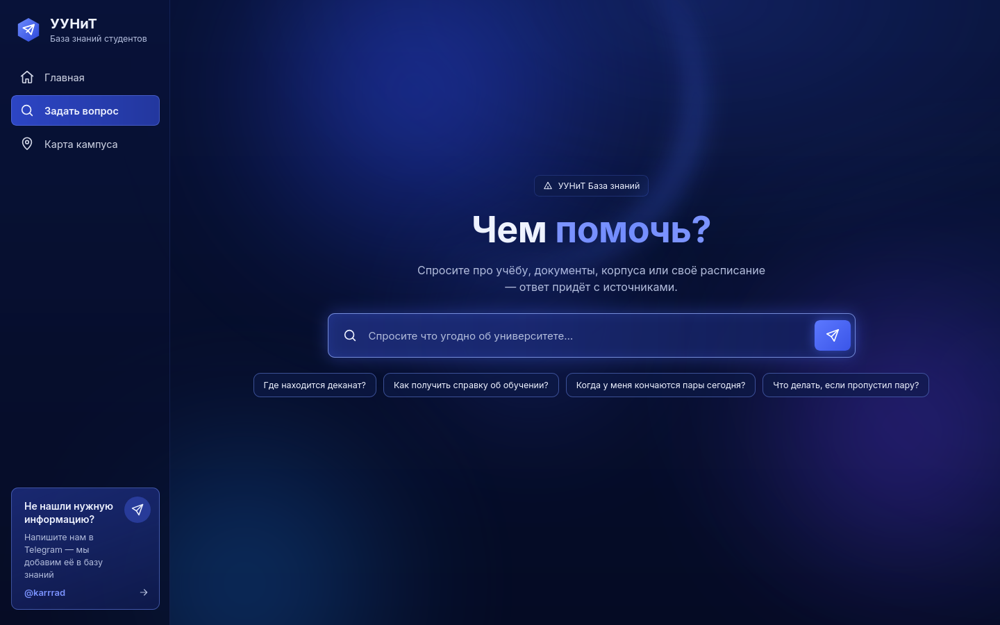
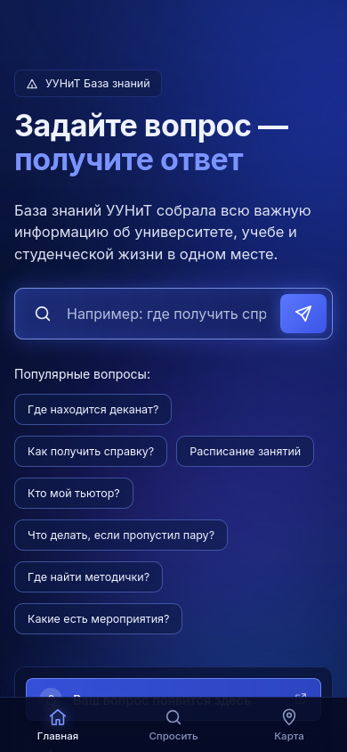
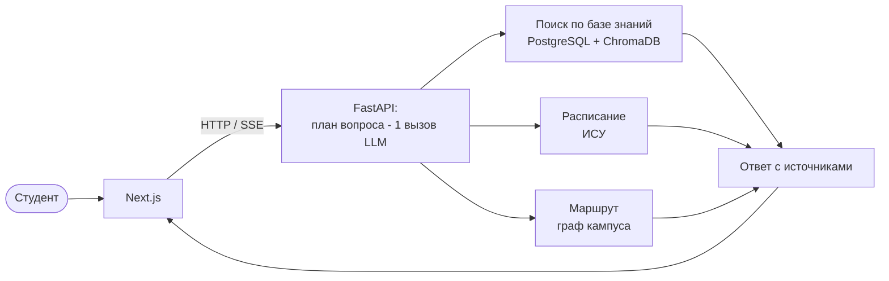

# УУНиТ База знаний

[](https://github.com/wprojectsuust/knowledge_base/actions/workflows/ci-cd.yml)

ИИ-консультант для студентов Уфимского университета науки и технологий: отвечает на вопросы
об учёбе, документах и жизни в вузе по проверенной базе знаний, показывает источник, знает
расписание групп и прокладывает маршрут по кампусу на 3D-карте.

**Попробовать:** https://karrad.tech/uunit/ · **Документация:** [docs/](docs/README.md)



## Зачем

Первокурсник тонет в информации: сайт вуза большой, ответы разбросаны по положениям, чатам
групп и советам старшекурсников, а спросить не у кого или неловко. Поиск по сайту не понимает
разговорных вопросов, общий чат-бот уверенно выдумывает правила конкретного вуза.

Наш консультант отвечает **только** по базе знаний УУНиТ, честно говорит, когда ответа нет, и
показывает, откуда взята информация.

## Возможности

- **Ответы по базе знаний со ссылкой на источник.** Поиск по смыслу, а не по словам: к каждому
  фрагменту заранее сгенерированы вопросы студентов (RAG).
- **«Второй шанс».** Нет прямого ответа - консультант сам ищет недостающее («сколько лет декану»
  -> кто декан -> дата рождения -> посчитать) и показывает, что делает прямо сейчас.
- **Несколько вопросов в одном сообщении** - «какие завтра пары у ТОП-106Б и где деканат ФИРТ».
- **Расписание группы** из ИСУ на любую дату: «во сколько у меня завтра кончаются пары».
- **Уточняющие вопросы** вместо угадывания: спросит группу один раз и запомнит.
- **Навигатор по кампусу УГАТУ.** Маршрут «из 3-201 в 8-305» тёплыми переходами (включая
  подземный под КПП) на 3D-карте, уличный вариант - пунктиром рядом.
- **Контекст диалога** - «а туда как пройти?» - без аккаунтов: история живёт в браузере.
- **Сама пополняется** новостями и списком официальных документов с uust.ru.
- **Устойчивость:** запасные LLM-модели, кэш ответов, понятная ошибка вместо падения.
- **Удобно с телефона:** нижние вкладки, адаптивная карта и чат.

| Чат | Телефон |
|---|---|
|  |  |

## Как это работает



Вопрос разбирается одним вызовом LLM на части, части выполняются параллельно, ответы
сводятся в один. Подробно - [docs/architecture.md](docs/architecture.md), причины решений -
[docs/adr/](docs/adr/README.md).

## Стек

| Часть | Технологии |
|---|---|
| Бэкенд | Python 3.11, FastAPI (async), pydantic, asyncpg, httpx, BeautifulSoup |
| Поиск | ChromaDB, sentence-transformers `cointegrated/rubert-tiny2` (CPU) |
| LLM | любой OpenAI-совместимый API (сейчас Qwen через claudehub, запасной - Gemini) |
| Данные | PostgreSQL 16 |
| Фронтенд | Next.js 15, React 19, TypeScript, three.js (react-three-fiber), react-markdown |
| Инфраструктура | Docker Compose, nginx, GitHub Actions |
| Качество | pytest (194 юнит-теста, покрытие ~88%), TDD, чистая архитектура, ADR |

## Быстрый старт

```bash
git clone https://github.com/wprojectsuust/knowledge_base.git && cd knowledge_base
make env        # создаст .env из .env.example - впишите LLM_API_KEY (или GEMINI_API_KEY)
make up         # поднимет backend + frontend + postgres
```

- фронтенд - http://localhost:3000;
- бэкенд - http://localhost:8000, Swagger UI - `/docs`, загрузка данных в базу знаний - `/`.

Запуск без Docker, прод и CI/CD - [docs/deployment.md](docs/deployment.md); все настройки -
[docs/configuration.md](docs/configuration.md).

## Структура репозитория

```
.
├── backend/                 FastAPI-сервис (чистая архитектура)
│   ├── src/
│   │   ├── domain/          сущности и чистая логика (план вопроса, граф кампуса…)
│   │   ├── use_cases/       сценарии: Question, PlanQuestion, ResearchAnswer, NewData, импорты
│   │   ├── services/        прокси к LLM, эмбеддингам, хранилищам
│   │   ├── repositories/    Protocol-интерфейсы и реализации: Postgres, Chroma, ИСУ, uust.ru, campus.json
│   │   └── api/             роуты, схемы, сборка зависимостей
│   └── tests/               unit / integration / e2e / stress
├── frontend/                Next.js: app/ (страницы), components/, lib/
├── docs/                    документация, ADR, дерево файлов
├── .github/                 CI/CD, шаблоны PR и issue
├── docker-compose.yml       локальный стек
└── docker-compose.prod.yml  прод-оверлей (за nginx)
```

## Документация

| | |
|---|---|
| [Архитектура](docs/architecture.md) | компоненты, слои, путь вопроса |
| [API](docs/api.md) | эндпоинты, SSE, ошибки |
| [База знаний](docs/knowledge-base.md) | как добавлять данные и писать фрагменты |
| [Карта кампуса](docs/campus-map.md) | формат данных, навигатор |
| [Конфигурация](docs/configuration.md) | переменные окружения |
| [Деплой](docs/deployment.md) | запуск, прод, CI/CD |
| [Фронтенд](docs/frontend.md) | страницы, компоненты, адаптив |
| [Тестирование](docs/testing.md) | пирамида тестов |
| [ADR](docs/adr/README.md) | архитектурные решения |
| [CONTRIBUTING](CONTRIBUTING.md) · [CHANGELOG](CHANGELOG.md) · [SECURITY](SECURITY.md) | для участников |

## Команда

| Участник | Роль |
|---|---|
| Кара Дмитрий Алексеевич | Ведущий разработчик: архитектура, бэкенд, фронтенд, развёртывание |
| Карамов Максим Радикович | ML-инженер: модели, эмбеддинги, поиск и работа с LLM |
| Баранов Алексей Антонович | Данные и база знаний: сбор и подготовка материалов |
| Гумерова Камилла Хамитовна | Данные и база знаний: сбор и подготовка материалов |
| Ткаченко Денис Юрьевич | Презентация и продвижение продукта |

Нашли ошибку в ответе или не хватает информации - напишите в Telegram
[@karrrad](https://t.me/karrrad) или [создайте issue](https://github.com/wprojectsuust/knowledge_base/issues/new/choose).
