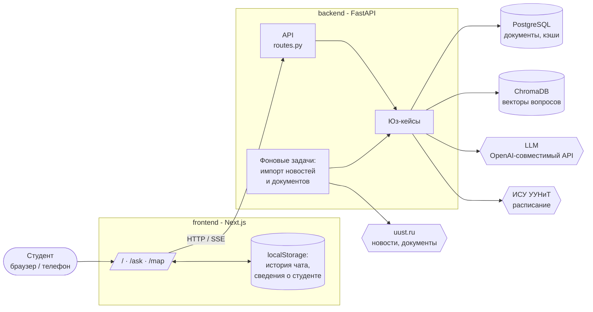
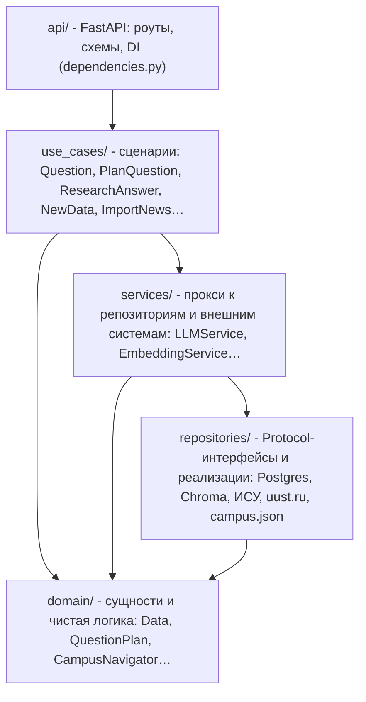
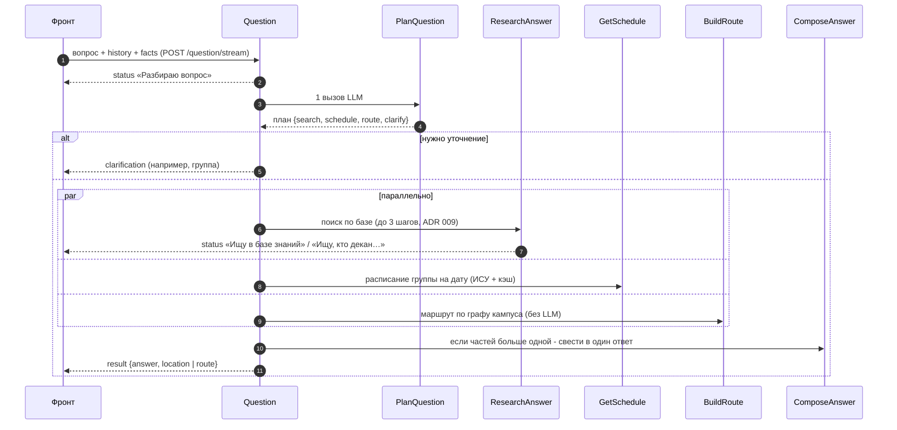
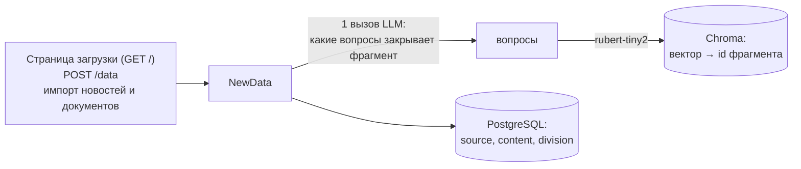

# Архитектура

## Общая схема

- **frontend** - Next.js 15 / React 19: чат, 3D-карта кампуса (react-three-fiber), адаптив под
  телефоны. Состояние пользователя хранит только в браузере (ADR 005).
- **backend** - FastAPI (async): RAG по базе знаний, расписание, навигатор, автоимпорт.
- **PostgreSQL** - тексты фрагментов базы знаний (`documents`), кэш вопрос-ответ, кэш расписания.
- **ChromaDB** - эмбеддинги вопросов к фрагментам (rubert-tiny2), локальный клиент (ADR 004).
- **LLM** - любой OpenAI-совместимый API с запасными моделями (ADR 003).

## Слои бэкенда (чистая архитектура)

| Слой | Что лежит | Правило |
|---|---|---|
| `domain/` | Датаклассы и чистая логика без I/O: `Data`, `QuestionPlan`, `ClarificationRequest`, граф кампуса `CampusNavigator`, порции документов | Ничего не импортирует из других слоёв |
| `repositories/` | `Protocol`-интерфейсы (`DataRepository`, `VectorRepository`, `ScheduleRepository`…) и их реализации | Единственное место, где есть SQL, HTTP к внешним сайтам, файлы |
| `services/` | Тонкие прокси над репозиториями, LLM и моделью эмбеддингов; семафоры конкурентности | Юз-кейсы зависят от сервисов, а не от реализаций |
| `use_cases/` | Сценарии приложения, каждый - класс с `execute()` | Зависимости только через конструктор |
| `api/` | Роуты, pydantic-схемы, сборка графа зависимостей (`dependencies.py`, `lru_cache`-фабрики) | Роут = разбор запроса -> юз-кейс -> схема ответа |

Композиция - в `backend/src/api/dependencies.py`; в тестах юз-кейсы собираются с фейками из
`tests/conftest.py`.

## Как отвечаем на вопрос

1. **План** (`PlanQuestion`, ADR 002) - один вызов LLM: какие части нужны, переформулировка с
   учётом истории, нормализация группы и даты.
2. **Части выполняются параллельно:**
   - `ResearchAnswer` - векторный поиск -> LLM отвечает, либо просит ещё поиск, либо уточнение;
   - `GetSchedule` - расписание из ИСУ (кэш в Postgres с TTL) и ответ именно на заданный вопрос;
   - `BuildRoute` - Dijkstra по графу кампуса и шаблонный текст (ADR 007).
3. **Сведение** (`ComposeAnswer`) - если частей несколько, один связный ответ на исходный вопрос.
4. **Место на карте** (`ResolveLocation`) - если в ответе упомянут корпус/кабинет, фронт
   показывает мини-карту, которая «прилетает» из угла в центр.

Кэш вопрос-ответ - только для чистого поиска без истории; при добавлении/удалении данных кэш
очищается.

## Как данные попадают в базу знаний

Подробнее - [knowledge-base.md](knowledge-base.md).

## Фронтенд

| Путь | Что там |
|---|---|
| `/` | Главная: поиск, популярные вопросы, карточка ответа, быстрый доступ |
| `/ask` | Чат: лента ответов с печатью, уточнения, источники, история в `localStorage` |
| `/map` | 3D-карта кампуса УГАТУ: корпуса, этажи, кабинеты, маршрут «откуда -> куда» |

Подробнее - [frontend.md](frontend.md).

## Дерево файлов

Актуальное дерево репозитория с подсчётом строк - [`docs/tree`](tree), пересобирается
git-хуком перед каждым коммитом (`make hooks`).
