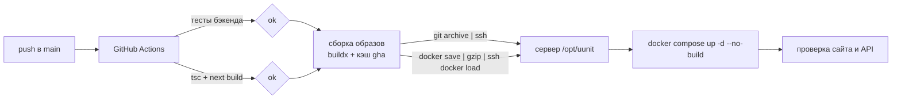

# Запуск и деплой

## Локально через Docker (рекомендуется)

Нужны Docker с compose v2 и `make`.

```bash
git clone https://github.com/wprojectsuust/knowledge_base.git
cd knowledge_base
make env          # .env из .env.example
# впишите LLM_API_KEY (или GEMINI_API_KEY) в .env
make up           # backend + frontend + postgres
make hooks        # один раз: pre-commit хук, пересобирающий docs/tree
```

| Сервис | Адрес |
|---|---|
| Фронтенд | http://localhost:3000 |
| Бэкенд | http://localhost:8000 (Swagger UI - `/docs`, загрузка данных - `/`) |
| PostgreSQL | `localhost:5432` |

Первый старт бэкенда качает модель эмбеддингов (~120 МБ), это займёт минуту.

| Команда | Что делает |
|---|---|
| `make build` | собрать образы |
| `make up` / `make down` / `make restart` | поднять / остановить / перезапустить стек |
| `make logs` / `make ps` | логи / состояние контейнеров |
| `make shell` / `make shell-frontend` | shell в контейнере бэкенда / фронта |
| `make clean` | остановить и **удалить тома** (база знаний и векторы пропадут) |

Команды тестов - в [testing.md](testing.md).

## Локально без Docker

**Бэкенд** (Python 3.11+, нужен запущенный PostgreSQL, например `docker compose up -d postgres`):

```bash
cd backend
python -m venv .venv
.venv/bin/pip install torch --index-url https://download.pytorch.org/whl/cpu
.venv/bin/pip install -e ".[dev]"
POSTGRES_HOST=localhost .venv/bin/python main.py      # http://localhost:8000
```

`main.py` читает `.env` из текущего каталога (python-dotenv); переменные можно задать и в окружении.

**Фронтенд** (Node 20):

```bash
cd frontend
npm install
npm run dev                                            # http://localhost:3000
```

Бэкенд фронт ищет на том же хосте, порт `8000`. Другой адрес - `NEXT_PUBLIC_API_BASE_URL`.

## Прод

Прод: **https://karrad.tech/uunit/**. Это общий сервер (1 CPU, ~1 ГБ RAM, небольшой диск),
на котором живут и другие сайты, поэтому образы на нём **не собираются** (ADR 010).



### Стек на сервере

```
/opt/uunit
├── docker-compose.yml        # общий файл
├── docker-compose.prod.yml   # прод-оверлей
└── .env                      # секреты, лежит только на сервере, деплой его не трогает
```

```bash
docker compose -f docker-compose.yml -f docker-compose.prod.yml up -d --no-build
```

Прод-оверлей ([`docker-compose.prod.yml`](../docker-compose.prod.yml)):
- порты только на `127.0.0.1`: фронт `5000`, бэкенд `5001`; PostgreSQL наружу не публикуется;
- `restart: unless-stopped`;
- ротация логов контейнеров: 3 файла по 10 МБ;
- volume `hf_cache` - модель эмбеддингов не перекачивается при пересоздании контейнера;
- фронт собран с `BASE_PATH=/uunit` и `NEXT_PUBLIC_API_BASE_URL=/uunit/api`.

### nginx

Сайт домена проксирует два пути:

```nginx
location /uunit/api/ {
    proxy_pass http://127.0.0.1:5001/;      # слэш в конце срезает /uunit/api
    proxy_http_version 1.1;
    proxy_read_timeout 180s;                # ответ со «вторым шансом» может идти долго
    proxy_set_header Host $host;
    proxy_set_header X-Forwarded-For $proxy_add_x_forwarded_for;
    proxy_set_header X-Forwarded-Proto $scheme;
}
location /uunit {
    proxy_pass http://127.0.0.1:5000;
    proxy_http_version 1.1;
    proxy_set_header Host $host;
    proxy_set_header X-Forwarded-For $proxy_add_x_forwarded_for;
    proxy_set_header X-Forwarded-Proto $scheme;
}
```

Буферизацию для потокового `/question/stream` бэкенд отключает сам заголовком
`X-Accel-Buffering: no` - отдельная настройка nginx не нужна.

### CI/CD

Workflow - [`.github/workflows/ci-cd.yml`](../.github/workflows/ci-cd.yml).

| Событие | Что запускается |
|---|---|
| pull request | `backend-tests` (pytest) и `frontend-build` (`tsc --noEmit` + `next build`) |
| push в `main` | то же + `deploy` |
| вручную (`workflow_dispatch`) | то же, что push |
| коммит с `[skip ci]` | ничего - для правок документации |

Шаги `deploy`:
1. сборка `uunit-backend:latest` и `uunit-frontend-prod:latest` с кэшем GitHub Actions;
2. `git archive HEAD` -> `/opt/uunit` на сервере (`.env` не затрагивается);
3. проверка свободного места: меньше 1,5 ГБ - деплой останавливается;
4. `docker save | gzip | ssh … docker load` - в образе меняются только новые слои;
5. `compose up -d --no-build --remove-orphans`, `docker image prune -f`;
6. до 5 минут ждём ответа `https://karrad.tech/uunit` и `/uunit/api/campus`; не дождались -
   в лог job-а выводятся последние логи бэкенда, job падает.

Секреты репозитория (environment `production`): `DEPLOY_SSH_KEY` (приватный deploy-ключ),
`DEPLOY_KNOWN_HOSTS`, `DEPLOY_HOST`.

### Ручной деплой (запасной путь)

Если GitHub Actions недоступен - собрать локально и отправить образы так же, как CI:

```bash
docker compose -f docker-compose.yml -f docker-compose.prod.yml build
docker save uunit-backend:latest uunit-frontend-prod:latest | gzip -1 | ssh <сервер> 'gunzip | docker load'
ssh <сервер> 'cd /opt/uunit && docker compose -f docker-compose.yml -f docker-compose.prod.yml up -d --no-build'
```

### Обслуживание

| Задача | Как |
|---|---|
| Логи бэкенда | `docker logs --tail 200 -f uunit-backend-1` |
| Залить пачку фактов | страница `https://karrad.tech/uunit/api/` или `POST /data` (см. [knowledge-base.md](knowledge-base.md)) |
| Место на диске | `df -h /`, `docker system df`; containerd хранит слои образов примерно вдвое |
| Бэкап базы знаний | `docker compose … exec -T postgres pg_dump -U uunit uunit > backup.sql` + том `uunit_chroma_data` |
